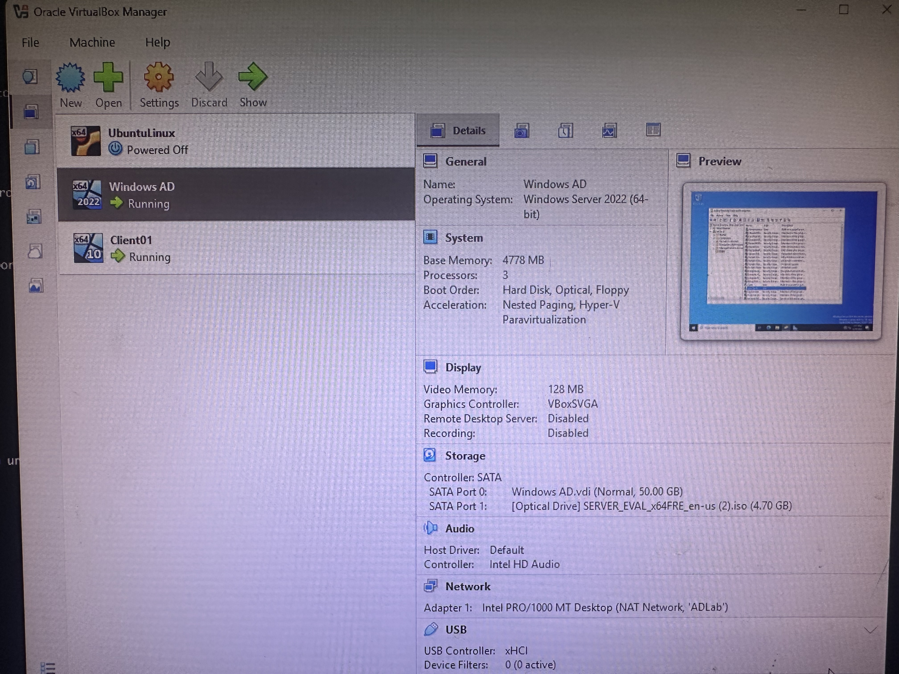
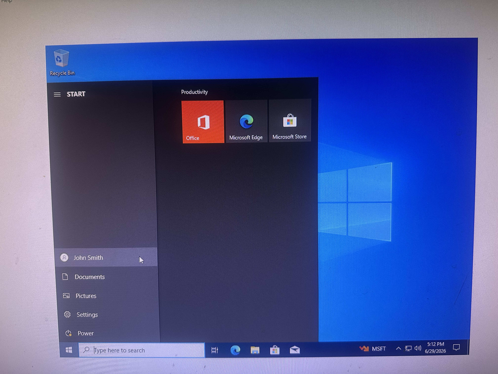
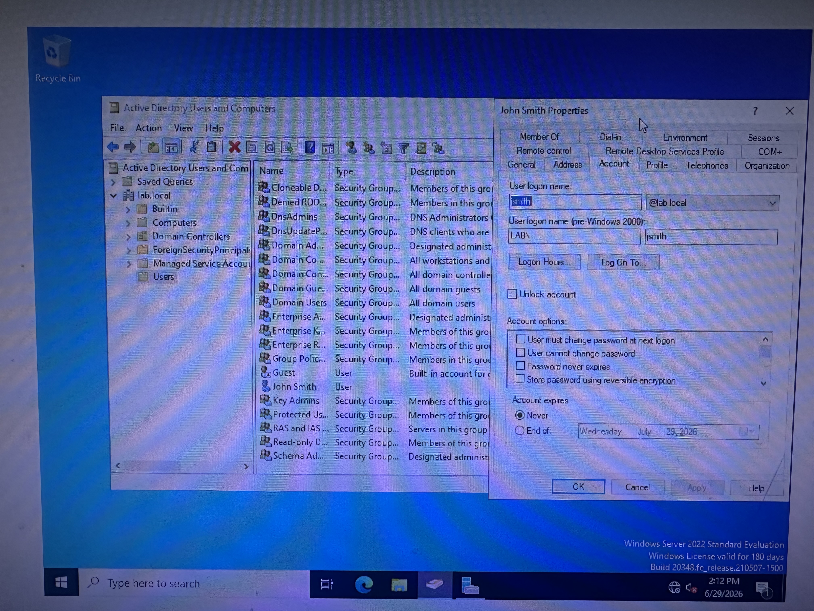
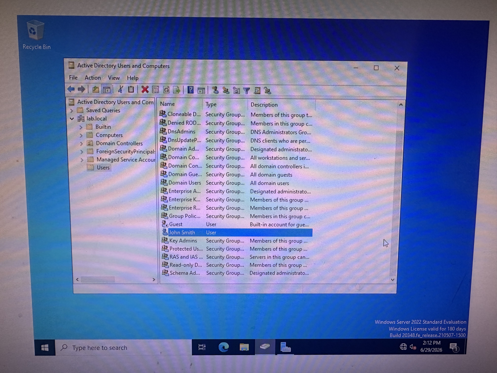
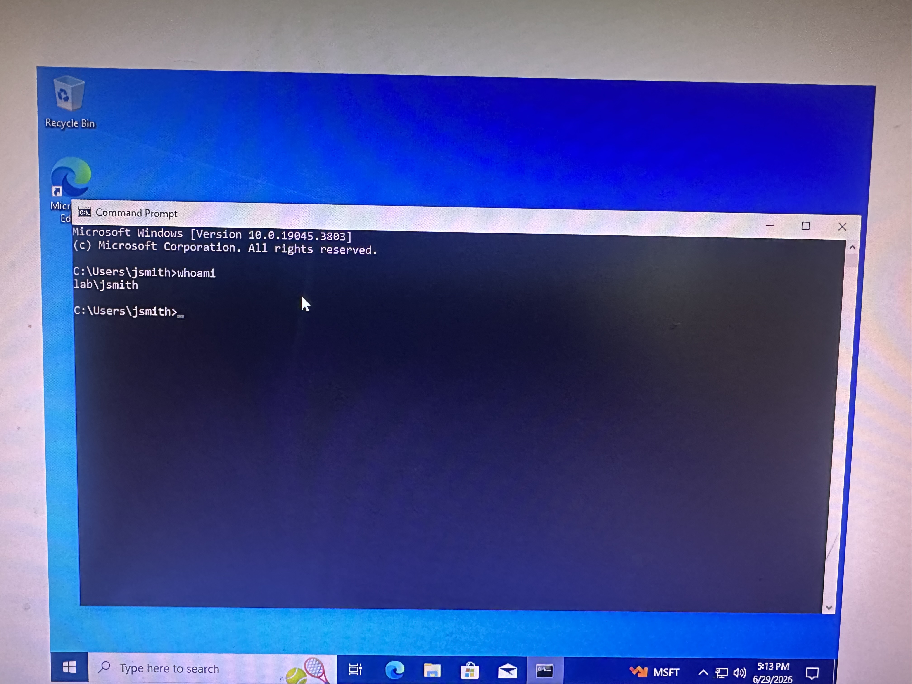

# Active Directory Home Lab

## Overview
Built a fully functional Active Directory home lab from scratch using VirtualBox 
to simulate a real enterprise environment. This lab was designed to practice 
help desk and SOC analyst workflows including user lifecycle management, 
account troubleshooting, and domain administration.

## Lab Environment
| Component | Details |
|-----------|---------|
| Hypervisor | Oracle VirtualBox |
| Domain Controller | Windows Server 2022 Standard Evaluation |
| Client Machine | Windows 10 Pro |
| Domain Name | lab.local |
| Network | NAT Network (ADLab - isolated environment) |

## Virtual Machine Setup

*Oracle VirtualBox showing Windows AD (Domain Controller) and Client01 
both running on the ADLab NAT Network*

## What I Built
- Provisioned a Windows Server 2022 VM and configured it as a Domain Controller
- Installed and configured Active Directory Domain Services (AD DS)
- Promoted the server to a Domain Controller and created a new forest (lab.local)
- Configured a private NAT Network so VMs could communicate securely
- Installed Windows 10 Pro and joined it to the lab.local domain
- Configured DNS on the client to point to the Domain Controller

## Server Manager — AD DS & DNS Installed

*Server Manager showing AD DS and DNS roles successfully installed 
and running on Windows Server 2022*

## Active Directory Users and Computers

*Active Directory Users and Computers showing the lab.local domain 
with John Smith created as a domain user*

## User Account Management

*John Smith user properties in ADUC showing domain logon name 
(jsmith@lab.local) and account configuration options*

## Client Machine — Logged in as Domain User

*Windows 10 Client01 Start Menu showing John Smith logged in 
as a domain user*

## Domain Authentication Proof

*Command Prompt on Client01 showing whoami output as lab\jsmith — 
confirming successful domain authentication*

## Skills Practiced

### User Lifecycle Management
- Created domain user accounts in Active Directory Users and Computers (ADUC)
- Set password policies and account properties
- Enabled and disabled user accounts
- Simulated onboarding and offboarding workflows

### Help Desk Ticket Simulations
| Ticket | Issue | Resolution |
|--------|-------|------------|
| #001 | User account disabled | Located account in ADUC, right-clicked and enabled |
| #002 | User cannot reach domain | Verified DC was running, confirmed DNS settings on client |
| #003 | New user needs access | Created account in ADUC, set password, logged in successfully |
| #004 | Prove domain authentication | Ran whoami in CMD, confirmed lab\jsmith |

## Troubleshooting Challenges
During the build I encountered and resolved several real-world issues:

- **Wrong ISO mounted** — VirtualBox auto-generated a .viso file instead of 
  mounting the Windows Server ISO, causing license term errors. Resolved by 
  manually remounting the correct ISO.
- **Server Core installed instead of Desktop Experience** — Selected the wrong 
  Windows Server version. Reinstalled choosing Desktop Experience for GUI access.
- **Client could not find domain** — DNS on CLIENT01 was pointing to the wrong 
  server. Fixed by setting the preferred DNS to DC01's IP address manually.
- **Account disabled on first login** — User account was created with disabled 
  checkbox active. Resolved through ADUC by enabling the account.

## Key Takeaways
- Active Directory is the backbone of enterprise identity management
- Most help desk tickets trace back to AD in some way
- DNS is critical — if the client can't find the DC, nothing works
- Documentation and methodical troubleshooting are as important as technical skills

## Tools Used
- Oracle VirtualBox
- Windows Server 2022
- Windows 10 Pro
- Active Directory Users and Computers (ADUC)
- PowerShell
- DNS Manager

## Next Steps
- [ ] Create Organizational Units (OUs) for departments
- [ ] Apply Group Policy Objects (GPOs)
- [ ] Forward AD logs to Wazuh SIEM for monitoring
- [ ] Practice account lockout and unlock procedures
- [ ] Add a second client machine to simulate larger environment
